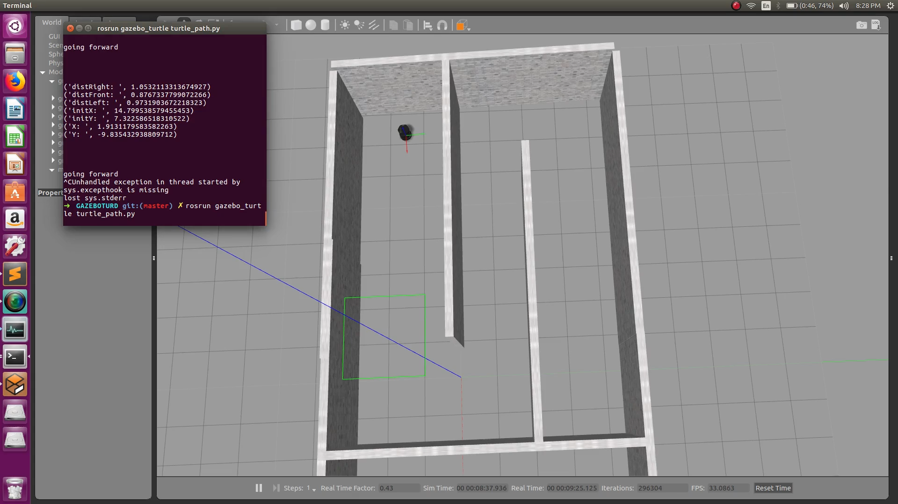

# TurtleMover

This is a Package I made to complete the following task:
> Write ros node to control the movement of turtlebot so as to reach from current
starting point to position marked in red. Use LaserScan data and move turtlebot in the
direction of farthest obstacle in the world. No predefined movement to be written in the
node. The safe distance from obstacle is 0.5 m.

## Installation

After installing [ROS Kinetic Desktop Full](http://wiki.ros.org/kinetic/Installation/Ubuntu) on [Ubuntu 16.04](http://cdimage.ubuntu.com/netboot/16.04/), install [turtlebot_gazebo](http://wiki.ros.org/turtlebot_gazebo) package then run the following commands:

```
$ export TURTLEBOT_GAZEBO_WORLD_FILE="/opt/ros/kinetic/share/turtlebot_gazebo/worlds/corridor.world"
$ roslaunch turtlebot_gazebo turtlebot_world.launch
```
After this Gazebo should open up, move the turtlebot to starting position, it should look something like this:



If you are facing any issues please refer to [ROS](https://answers.ros.org/questions/) or [Gazebo](http://answers.gazebosim.org/questions/) forums. If you are a newcomer to ROS or Gazebo please refer to [A Gentle Introduction to ROS](https://cse.sc.edu/~jokane/agitr/) and [Gazebo Tutorials](http://gazebosim.org/tutorials)

## Code Execution

Download and extract the code in a Directory say `ROS_WORKSPACE`, From the `ROS_WORKSPACE` Directory in your terminal run the following commands:

```
$ catkin_make
$ source devel/setup.bash #use source devel/setup.zsh for zsh
$ chmod 777 src/gazebo_turtle/turtle_path.py
$ rosrun gazebo_turtle/turtle_path.py
```

After running the above commands the turtlebot should start moving as shown in the video below:


The full video can be found [here](https://www.youtube.com/watch?v=aV1GmPjS0P4)

## The Code

The code is very simple to understand once you have some knowledge of ROS and gazebo. Use `rotopic list` to see topics and do `rostopic echo /scan` to see laser data. The laser used in turtlebot has an angle from -30 to 30 degrees. Hence 0th value and last value represent right and left of turtlebot and mid value represents the front.

Using this data the turtlebot moves in the direction of farthest object, and if the distance from some object goes close to 0.75m it takes appropriate action to avoid collision